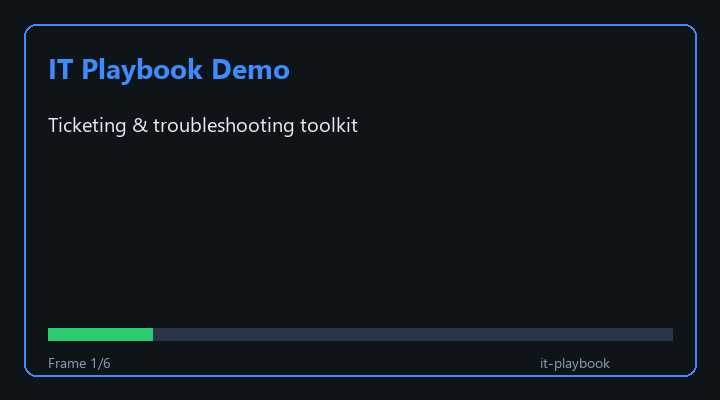

# IT Troubleshooting Playbook & Tools

**First-contact IT support** — help desk ticketing, phone, email, and in-person. Windows 11 Pro, Microsoft 365, VPN, Wi-Fi, printers, SharePoint/OneDrive.

[](demo/demo.gif)

---

## How to use (3 steps)

```powershell
git clone https://github.com/AbisoyeOnanuga/it-playbook.git
cd it-playbook
.\scripts\new_ticket.ps1
```

1. **Answer the prompts** (contact channel, user name, location, issue, on-site y/n, priority).
   - **Menus:** type the **number** (`1`) **or** the **word** (`phone`) — not the full line `1) Phone`.
   - **Enter alone** = accept the default shown in brackets.
   - Wrong answer? Script re-asks; it won't silently pick the wrong option.
2. **Ctrl+V** into your help desk ticket — text is copied to clipboard automatically.
3. **Edit if needed** — Notepad opens; a copy is saved in `tickets\` (e.g. `tickets\2026-06-11_1151_jane-smith_no-internet.txt`).

No parameters. No hunting in `%TEMP%`.

| If you are... | Say at prompt | Result |
|---------------|---------------|--------|
| Phone / email / ticket portal from **your desk** | Not on user's PC | Ticket from **user-reported** facts — your PC is **not** scanned |
| **In person** at user's computer | Yes, on user's PC | Diagnostics zip from **their** machine → `tickets\diag_*.zip` |

Step-by-step walkthroughs: [`playbook.md`](playbook.md) · [`docs/coordinator_workflow.md`](docs/coordinator_workflow.md)

---

## Example session (desk / phone)

```
> .\scripts\new_ticket.ps1

Contact channel: 1 Phone  2 Email  3 Ticketing system  4 In person
  Words accepted: phone, email, ticket, in person, ...
Type the number or word [Enter = 3]: phone
```

Employee name: jane.smith
Site / building: Main office
Issue category: 1 Network / Wi-Fi
Device type: 2 Laptop
Issue summary: No internet - websites will not load
On user's PC now? y / n [n]: n
User PC hostname: LAPTOP-JSMITH
Symptoms: ping 8.8.8.8 fails; Wi-Fi shows connected

READY FOR TICKETING SYSTEM
  1. Ctrl+V in your help desk ticket
  2. Saved copy: tickets\2026-06-11_1151_jane-smith_no-internet.txt
```

---

## What's in the repo

| Path | Use |
|------|-----|
| [`scripts/new_ticket.ps1`](scripts/new_ticket.ps1) | **Run this** — interactive new ticket |
| [`playbook.md`](playbook.md) | Full how-to + walkthroughs |
| [`docs/coordinator_workflow.md`](docs/coordinator_workflow.md) | IT Coordinator duties → workflow |
| [`docs/commands_reference.md`](docs/commands_reference.md) | `ipconfig`, `ping`, `nslookup`, … |
| [`scripts/user_collect_diagnostics.ps1`](scripts/user_collect_diagnostics.ps1) | Send to user — they email zip back |

Regenerate demo GIF: `python scripts/generate_demo_gif.py`

---

## License

MIT — see [LICENSE](LICENSE).
